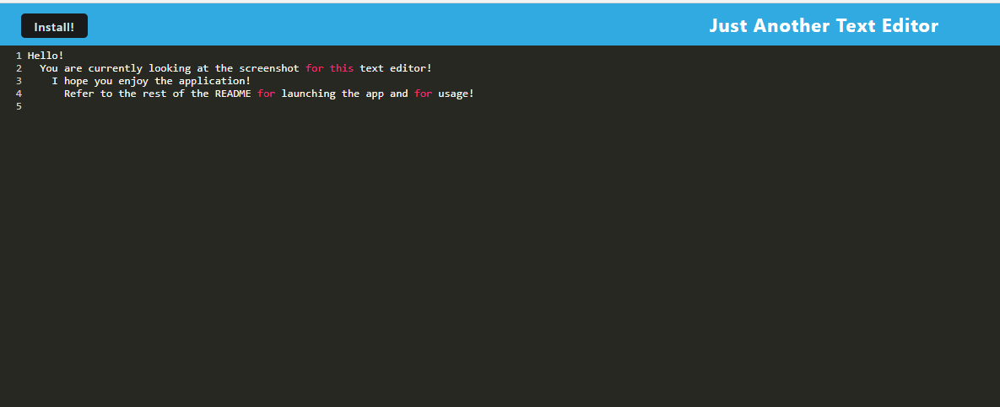

# Joseph Rodante - Text Editor

## Table of Contents
- [Description](#description)
- [Installation](#installation)
- [Usage](#usage)
- [Questions](#questions)

## Description
- This software allows you to edit text in browser.

## Installation
- N/A
- [Link to Application](https://jr-text-editor-077c473a9864.herokuapp.com/)

## Usage
- Click anywhere to place the cursor.
- Type to enter characters and words.
- Press enter to go to the next line.
- Press the "Install!" to download the applacation and open it outside of the browser.

## Questions
- Contacts for questions about the software:
- GitHub: github.com/joeyrodo
- Email: joeyrodo@gmail.com